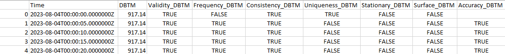
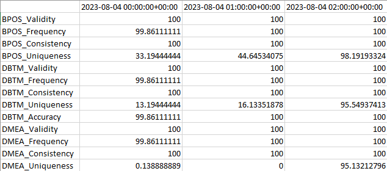
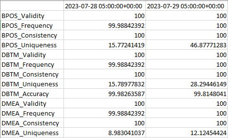
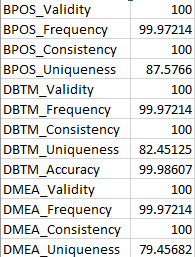
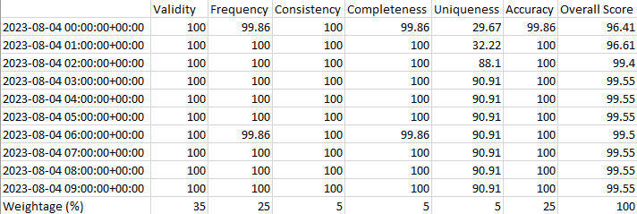
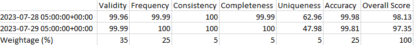
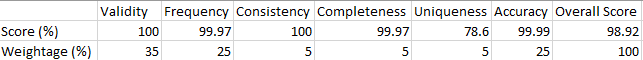

# Petrolink DataQuality Algorithm (Open-Sourced Python Implementation)
This "DataQuality_Algorithm" repository is the home of Petrolink's "open sourced" python DataQuality algorithm.

In this repository there are three main directories, these are "Input", "src", and "Output. The "Input" directory is self explanatory as that is where users are to put static ".csv" data they would like to run a DataQuality analysis on. The "src" directory is where users will find the source code that drives the Data Quality algorithm. The "Output" directory just as the "Input" is self explanatory as that is where users will can find the data quality output produced by the Data Quality Algorithm after execution.

There is one python.py program/script that make up the source code for the python implementaion of the Data Quality Algorithm and one package. These are the runner (dq_runner.py) and the module/package (dq_dimensions). The runner is an executable script where the user input is loaded into a dataframe and manipulated using functions from the module to produce Data Quality output. The module is where the dimension calculation functions for the algorithm are located. 

## Table of Contents
1. [What is DataQuality](#what-is-data-quality)
2. [Dimensions of Data Quality](#dimensions-of-data-quality)
3. [Directory Guide](#directory-guide)
4. [Installation and Setup](#installation-and-setup)
5. [Outputs Explained](#outputs-explained)
6. [Future Steps](#future-steps)

## What is Data Quality
Data can be defined as factual information in digital form produced by a sensing device which is used as a basis for reasoning, discussion, or calculation.  As this data becomes or is becoming the integral part of day to day operation, it is very important to determine and report the quality of such data to customers which rely on the data to make engineering and business decisions. 

In order to determine the importance of data quality analysis and how it affects decision making, we must bear in mind that garbage in is garbage out.  So, the question is "Can we differentiate Garbage data from Zero defect data?" Once we can identify and tag data with the determined quality indicators, the user can make a judgement of the data for the specific application in hand. 

## Dimensions of Data Quality
Data Quality(DQ) dimension is a recognized term used by data management professionals to describe a feature of data that can be measured or assessed against defined standards in order to determine the quality of data. In other words, something (data item, record, data set or database) that can either be measured or assessed based on various standards in order to understand the quality of data. 

We have collected the various aspects with which the quality of the surface and subsurface data can be quantified as: 

1. Frequency 
2. Completeness 
2. Uniqueness 
4. Consistency 
5. Validity 
6. Accuracy 

Multi-dimensional quality analysis concept includes screening every data point through various lenses and coming up with an Overall Score for Data Quality. 

The main intention is to use these dimensions to measure the impact of the poor data quality in terms of cost, regulatory compliance, and to increase the quality of the service provided. 

The client should agree to the adopted quality rules with which the data will be assessed against. In some cases, these rules can be decided by the client as these rules might interfere with their operational procedures. 

## Directory Guide
Input directory: Where users should put their .csv data that they wish to perform a Data Qulity analysis on.

Src directory: Location of the Data Quality Algorithm's source code.
  - Runner directory: Location of the executable runner's source code, configurations, unittesting suite, and [documentation](src/Runner).
  - dq_dimensions package directory: Location of the importable dimension module's source code, unittesting suite, and [documentation](scr/dq_dimensions).

Output directory: Location of the Data Quality Algorithm's output.

## Installation and Setup
1. Download the [DataQuality Algorithm Repo](https://github.com/Petrolink/Data-Quality/tree/master)
2. Install latest Python3
    - make sure to select "add Python to PATH"
3. Open command prompt
    - Enter "pip install pandas" 
    - Enter "pip install pyyaml"
    - Enter "pip install git+"
4. Place static .csv data to be analyzed into the "Input" directory 
    - Please ensure to provide a consistency check file if calculating consitency

## Outputs Explained
The python Data Quality Algorithm produces three types of output: 
### 1. curve_dimData - for entire dataset

**curve_dimData Output** - Includes curvewise dimension data for each curve for each sample in the input file, as well as the curvewise rigstatus values when CheckRigStatus config is enabled. 

### 2. score outputs - for each aggregation(hourly/daily/overall)

     
**Hourly Scores Output** - Includes the scores for each curves set of dimensions for every hour within the data set.

  
**Daily Scores Output** - Includes the scores for each curves set of dimensions for every day of data within the data set.

 

**Overall Scores Output** - Includes the scores for each curves set of dimensions for the entire dataset.

### 3. overall outputs - for each aggregation(hourly/daily/overall)

**Hourly Overall Output** - Includes the "overall" dimension scores as well as the DQ score for each hour of data in the dataset.

**Daily Overall Output** - Includes the "overall" dimension scores as well as the DQ score for each day of data in the dataset.

**Overall Output** - Includes the "overall" dimension scores as well as the DQ score for the entire dataset.

## Future Steps
1. Accept real-time dynamic data as well as static data.
2. Improve runner efficiency (run-time).
3. Add weekly, monthly, and yearly aggregations.
4. Create flow chart diagram of the algorithm's steps in the runner.