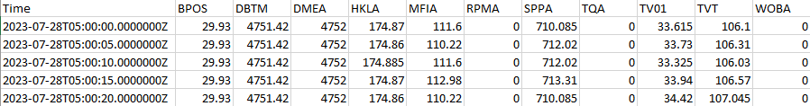

# Petrolink Data Quality Algorithm Script/Runner
This Data Quality Algorithm "Runner" is called a runner as it is the script that "runs" the recieved user input through the Data Quality Algorithm and produces output. The runner performs a data quality analysis by manipulating the input data recieved with the configurations set by users in the config.yaml file as well as functions imported from Petrolink's [dq_dimensions python module](../dq_dimensions). A module that includes the dimension and calculation logic necessary to produce Data Quality statistics/scores.

## Table of Contents

1. [Running](#running)
2. [Accepted Input](#accpted-input)
3. [Functionality](#functionality)
4. [Data Manipulation Processes](#data-manipulation-processes)
5. [Assumptions](#assumptions)
6. [Configurations](#configurations)
7. [Objects](#objects)
8. [Functions](#functions)
8. [Running Unit Tests](#running-unit-tests)

## Running
1. Update the runner configurations in config.yaml file (located in Runner directory) using the input data file accordingly.
2. Navigate to the Runner directory within a terminal/cmd
3. Within terminal enter the following 
    - Python .\dq_runner.py
4. Save desired Outputs to a directory outside the downloaded repository's "Output" directory as the runner will overwrite all output wihtin the "Output" repo directory each time it executes.

## Accpted Input
The Runner is expecting numerical .csv input, other file formats are not accepted at this time.
 - Input should be formatted similarly to the following example



 - Time Column should be named "Time" and follow the same time format:
    - '2023-07-28T05:00:00.0000000Z'
 - Curve Columns names should be unitless

## Functionality
1. Runner parses through the downloaded repo's "Input" directory searching for the file whose name matches the one provided within the "DataFile" configuration in config.yaml and load the input data into a mutable dataframe.
2. Runner then calculates and records each curves dimension values for every sample in the loaded dataframe, these newly calculated/created dimension columns are inserted into the original loaded dataframe. (This is the [curve_dimData.csv output](../../README.md#outputs-explained) in the Output directory)
3. Runner takes the dataframe that now contains dimensions and calculates the curve dimension scores for each aggregation (overall/hourly/daily) storing the calculated scores each into their own "aggregationscore" dataframes. (These are your [scores.csv outputs](../../README.md#outputs-explained) in the Output directory)
4. Using the calculated scores dataframes the runner then calculates the overall dimension scores as well as the DQ Score for each aggregation (overall/hourly/daily) storing the calculated overall scores into their own "aggregationoverall" dataframes. (These are your [overall.csv outputs](../../README.md#outputs-explained) in the Output directory).
5. Runner then outputs all created dataframes to .csv files within the Output repo directory.

## Data Manipulation Processes
The Data Quality Algorithm Runner calculates and produces its data quality statistics by running data recieved as input data through various data manipulation processes.

### 1. Calculating and Recording Dimensions
The first data manipulation process input data will undergo wihtin the runner is the proccess of calculating and recording the dimension values/states for every curve and sample (row of data). 
 - This process is very dependent upon the following user configurations in 'config.yaml':
    - Curve_configs
        - Runner uses all Curve_config names/headers/keys when looping through input dataframe columns headers to determine which columns are configured curves that need to have their dimensions calculated and recorded.
        - Runner Utilizes all Cuve_config values (ie. upLim, lowLim...) when calculating the dimensions values for each sample's curves.
    - General_configs
        - CalcConsistency
            - Runner checks to determine if consistency dimensions should be calculated. 
        - Check_RigStatuses:
            - Runner checks to determine if rig_statuses should be checked when calculating the uniqueness value for each sample.
    - Accuracy_configs
        - Runner checks the configured accuracy curve to ensure the accuracy dimension is only evaluated for the Bit Depth cuve.
 - Steps:
    1. Check if consistency should be calculated
    2. Create sDomains for the dataset (sub-process)
    3. Begin looping through input dataframe columns, ensure the current column is a configured curve if not skip the current column
    4. Determine if the current configured curve is BitDepth so accuracy dimension is set to be calculated
    5. Create empty lists for each dimension. (Done for every configured curve)
    7. Begin Looping through every value of the current configured curve 
    8. Call dimensions functions imported from dq_dimensions module and append their return values to their corresponding lists.
    9. Once done looping through every value of the current configured curve, the runner then inserts the newly created dimensions lists with the following format (Dimension_Curve, ie. Frequency_BPOS) to the right of the current curve within the input dataframe. 
    10. Once all curves dimensions have been calculated and inserted into the input dataframe, the runner calculates the overall completeness dimension.
        - Completeness is not being calculated and recorded for every curve as completeness is good if all curve frequencies for the current sample are good.

 - **Creating sDomains (SUBPROCESS)**
    - This Subprocess is the process of looping through every row in the input data set to create and fill a SampleDomain dictionary object with the required sample curve data used by the rig status check functions imported from dq_dimensions. 
    - This process is dependent upon the following configurations in 'config.yaml':
        - Curve_configs
            - Runner uses to reference the rule's for specific curves. 
        - Rule_configs
            - Runner uses to grab and store the threshold/rule values for the rules corresponding curve.

### 2. Calculating and Recording Scores 
The second data maniuplation process the runner puts the input data through is the process of calculating and recording the dimension scores for each curve, using the newly inserted dimension columns within the input dataframe. All aggregate data will go through the same process for each (hour/day) of data.
 - This process is dependent upon the following configurations in 'config.yaml':
    - Curve_configs
        - Uses the names/headers/keys of this configuration
    - Dimension_weights
        - Uses the names/headers/keys of this configuration
- Steps:
    1. Create an empty score dataframe to fill with data and return
    2. Begin looping through the curve dimension data column headers
    3. If the current column is a dimension column call the dim_score() function imported from the dq_dimensions module, runner passes the column data as a list as the argument
    4. Store the calculated score into the score dataframe created in step 1
    5. Once loop is complete return the filled in score dataframe

### 3. Creating Aggregate datasets/scores
The third data manipulation process the runner puts the input data through is the process of creating aggregate datasets. This process is actually done in parallel to the score calculation process for each aggregation. As the Runner grabs a (hour/day)s worth of data and passes it to the function that performs the calculation process and concatenates the scores produced by the calculation function to a dataframe for the current aggregation's scores (this is repeated for each (hour/day) of data).
 - This process is not dependent upon any configurations
 - Steps:
    1. Create an empty aggregate score dataframe to fill with aggregate data and return
    2. Create an empty temporary dataframe to store the current working (hour/day) of data
    3. Begin to loop through each sample of data, checking each samples timestamp
    4. Add each sample to the temporary dataframe created in step 2 until an (hour/day) of data has elapsed
    5. Once an (hour/day) of data has been temporarily stored, pass the temporary dataframe to the function that performs the calculation process.
    6. Store the current working (hour/day)s score to the aggregate score dataframe created in step 1
    7. Once done looping and every (hour/day) of data has scores return the aggregrate score dataframe.

### 4. Calculating and Recording Overall Scores 
The fourth and final data maniuplation processs the runner "runs" the input data through the the process of calculating and recording the overall dimension scores as well as the overall data quality score for the score dataset (entire or aggregate). 
 - This process is dependent upon the following configurations in 'config.yaml':
    - Dimension_weights
        - Runner uses config key/headers/names to create the overall dimension columns
        - Runner uses config values to determine the weights for each dimension when calculating the overall DQ score.
 - Steps
    1. Create an empty overall output dataframe to be filled with overall score data for the dataset
    2. Create empty lists for each dimension
    3. Begin to loop through score dataset
    4. If the current index is a dimension score append it to is corresponding dimension list created in step 2
    5. Once done looping through dataset, call the overall_dim() function imported from the dq_dimensions module for each dimension, passing the corresponding dimension list an argument.
    6. Store the overall dimension score returned from overall_dim() in the overall output dataframe created in step 1
    7. Once all overall dimension scores have all been calculated and stored calculate and store overall data quality score by taking a weightage average of the overall dimension scores using their corresponding configured weights.
    
    The Runner repeats steps 1-7 for every (hour/day) of dimension scores when calculating the overall scores for aggregate datasets.
    
    8. Return the overall output dataframe for the dataset.

## Assumptions
1. Assuming the curves configured under the Curve_configs within 'config.yaml' are identical to the corresponding curve headers within the input DataFile.csv.
2. Assuming input data is formatted with a "Time" column and unitless curve columns. [see example](#accpted-input)
3. Assuming there is an input file to be used as a consistency check log if CalcConsistency configuration is True.
4. Assuming the consistency check log is the same size as the input log.
5. Assuming Bit Depth, Block Position, SPP, RPM, and Hookload are constant curves in input.csv.
6. Assuming there is no domain rule for a curve if a Curve_configs rule configuration is empty.
7. Assuming accuracy is only being calculated on BitDepth.
8. Assuming there is a Bit Depth and Block Position curve in the input when calculating accuracy.
9. Assuming domain rules for the constant curves are configured under Rule_thresholds in 'config.yaml'


## Configurations
The Data Quality Runner is dependent upon its user configurations failure to follow the instructions below could lead to errors. There are 5 main configuration fields in the runners 'config.yaml' file.

### 1. General_configs
This configuration field is where users can toggle runner functionalities and provide the filenames of input users wish to run a data quality analysis on.
```
General_configs:
  DataFile: 'filename.csv'
  CheckFile: 'filename.csv'
  CalcConsistency: True/False
  CheckRigStatuses: True/False
  freqTol: 5.0
```
 - **DataFile**
    - Specify the file name (within apostraphes '') of the desired input in the "Input" repo directory that you wish to run a data quality anlysis on.
    - ie. 'yourfile.csv'
- **CheckFile**
    - Specify the file name (within apostraphes '') of the desired input in the "Input" repo directory that you wish to use as a consistency check log.
    - ie. 'yourfile.csv'
- **CalcConsistency**
    - Specify True/False to toggle consistency check functionality
    - If False, Data Quality will be calculated without a consistency dimension
- **CheckRigStatuses**
    - Specify True/False to toggle Rig Status Check Functionality (Used when calculating the Uniqueness dimension)

### 2. Curve_configs
This configuration field is where users are to specify configurations for each curve in their input dataset. Failure to configure all curves within input.csv log will lead to inaccurate Data Quality statistics as unconfigured curves will not be used.

Each Curve Configuration under Curve_configs should be listed sequentially and follow the format below:
```
  Name:
    upLim: float
    lowLim: float
    rigStatuses: (all/stationary/surface)
    rule: (Rule_Threshold configuration name/header)
```
 - **Name**
    - Specify the name of the curve
    - Names should be identical to the curve names/headers in the input log
- **upLim**
    - Specify the upper limit for the curve
    - Must be a float value (ie. 5.0)
- **lowLim**
    - Specify the lower limit for the curve
    - Must be a float value (ie. 5.0)
- **rigStatuses**
    - Specify the rigStatus to check when calculating the curve's uniqueness
    - Options:
        - all (checks all rig statuses)
        - stationary (only checks stationary)
        - surface (only checks on-surface)
- **rule**
    - Specify the rule(s) for the curve
    - A rule is one of the Rule_threshold configuration names (ie. Bit_Move)
    - Must be an empty rule, single rule, or a list of rules(only for bit depth) 
        ```
        rule: Bit_Move
            or
        DBTM:
          upLim: 6000.0
          lowLim: -0.0001
          rigStatuses: all
          rule: 
            - OnSurface
            - Bit_Move
        ```

### 3. Rule_thresholds
This configuration field is where users will set the "Domain Rule Thresholds" to be used by the runner.
```
Rule_thresholds:
  OnSurface: float
  RPM: float
  SPP: float
  Hookload: float
  Delta_BPOS: float
  Bit_Move: float
```
 - **OnSurface**
    - Specify the OnSurface threshold to be used for bit depth
    - Must be a float value (ie. 5.0)
 - **RPM**
    - Specify the RPM Threshold
    - Must be a float value (ie. 5.0)
- **Hookload**
    - Specify the SPP Threshold
    - Must be a float value (ie. 5.0)
- **Delta_BPOS**
    - Specify the Block Position delta threshold to be used for accuracy and rig status checks 
    - Must be a float value (ie. 5.0) 
- **Bit_Move**
    - Specify the bit movement threshold to be used for bit depth
    - Must be a float value (ie. 5.0)

### 4. Accuracy_config
This configuration field is where the user will provide a curve name for bit depth for the runner to use when calculating accuracy.
```
Accuracy_configs:
  Curve: Bit Depth Curve Name (ie. DBTM)
```
 - **Curve**
    - Specify the Bit Depth Curve name to be used for accuracy

### 5. Dimension_weights
This configuration filed is where the user will provide the dimension weightages to be used for calculating the Overall Data Quality Score.
```
Dimension_weights:
  Validity: int
  Frequency: int
  Consistency: int
  Completeness: int
  Uniqueness: int
  Accuracy: int
```
- **Validity**
    - Specify the weight this dimension holds for Data Quality.
    - Must be an int (ie. 5)
- **Frequency**
    - Specify the weight this dimension holds for Data Quality.
    - Must be an int (ie. 5)
- **Consistency**
    - Specify the weight this dimension holds for Data Quality.
    - Must be an int (ie. 5)
- **Completeness**
    - Specify the weight this dimension holds for Data Quality.
    - Must be an int (ie. 5)
- **Uniqueness**
    - Specify the weight this dimension holds for Data Quality.
    - Must be an int (ie. 5)
- **Accuracy**
    - Specify the weight this dimension holds for Data Quality.
    - Must be an int (ie. 5)

## Objects
The Data Quality Runner only utilizes 1 object.

**SampleDomain**
 - Imported dictionary object from dq_dimensions module.
 - Dictionary object that holds the curve value(s) and threshold information required to call the dq_dimension rig status checks functions on each sample within a data set. 

## Functions

**yaml_loader(filepath)**
 - Function that Loads a yaml file.
 - Returns the Loaded yaml config file as a dictionary.

**timeStr(string)**
 - Function that takes in a string and returns it as a datetime.
 - Returns a datetime value created from the timestamp string.

**get_Configs(cconfigType, testing)**
 - Function that retrieves the type of configuration and returns them as a iterable dictionary.
 - Returns the requested configuration field.

**fill_dataframe(itype, testing)**
 - Function that reads in a .csv file and returns a mutable dataframe filled with the .csv data.
 - Retruns a pandas dataframe with the input .csv data.

**createDimensions(dataframe)**
 - Void function that adds and calculates curve dimension columns in the dataframe passed in using the configurations set by user.

**createSDomains(dataframe, testing)**
 - Function that returns a dictionary filled with sampleDomains for each row in the dataframe passed by using the sampleDomains() function.
 - Returns dictionary of sDomain dictionaries for every row in the input data.

**fill_sampleDomain(cSample, pSample)**
 - Function that loads an empty sampleDomain dictionary template from dq.dimensions with data to be passed to checker functions in dq.dimensions using a sample(row of data) from a dataset.
 - Returns a sampleDomain dictionary loaded with data

**insertDims(dataframe, curveCol, dims)**
 - Void Function that aids createDimensions by inserting/formatting the calculated dimensions lists into the curveDimension Dataframe (data in main). 

**aggScores(dataframe, aggType)**
 - Function that calculates and records the Dimension scores for each curve for each [TYPE OF AGGREGATION] by using the calcScores() function for each (hour/day) of data.
 - Returns a pandas dataframe that includes the dimension scores for each curve for each [TYPE OF AGGREGATION REQUESTED].

**calcScores(dataframe)**
 - Function that calculates the Dimension scores for each curve using the dimScore function in the dq_dimensions lib.
 - Returns a pandas series that includes the dimension scores for each curve.

**aggOverall(dataframe)**
 - Function that creates the aggregation outputs and calculates the aggregation overall scores for the input dataset using the createOverall Function for each agg(hour/day) of scores.
 - Returns a pandas dataframe filled with overall aggregate output

**createOverall(series, hourly)**
 - Function that creates the overall output and calculates the overall scores for the input dataset using the OverallDim() function in the dq_dimensions lib.
 - Returns a pandas dataframe that includes the overall dimension scores and their corresponding weights set by user in config.yaml

**overallFormat(outData, dArr, dim, hourly, hour)**
 - Void Function that aids in formatting the DQout output dataframe in the createOverall() Function.

**calcOverallDQ(dataframe, hourly, hour, testing)**
 - Void Function that calculates the Overall DQ score for a dataset using the calcWeight and OverallDQ functions in the dq_dimensions lib.

## Running Unit Tests
This runner has a Unittest that contains unittesting suites for every function in the runner and the imported dq_dimensions module. These unittests can be run to debug any issues you may have when using the runner within an avg of 2 minutes. Any issues that are encountered that are not discaovered by the unitests should be submitted to developers to be resolved. 

### How to Run UnitTest
1. Download the dq_unittest.py file
2. Navigate to the directory that contains the test using console/terminal/IDE.
3. Enter 'Python dq_unittest.py' 

### Interpreting Results 
After running the unittests you will either recieve an "OK" message which is synonymous to passing.

```
............
----------------------------------------------------------------------
Ran 12 tests in 0.002s

OK
```
Or a "FAILED" message similar to the following:
```
.........E..
======================================================================
ERROR: test_overall_dq (__main__.Testdq_dimensions.test_overall_dq)
Testing overall_dq() Function in dq_dimensions that takes in a list containing weighted dimension scores of a dataset and returns the Overall DQ Score of said dataset
----------------------------------------------------------------------
Traceback (most recent call last):
  File "c:\Users\gonzaleza\OneDrive - Petrolink Technical Services\DataQuality_Algorithim\Src\dq_dimensions\dimensionsTest.py", line 280, in test_overall_dq
    self.assertRaises(TypeError, dq_dimensions.overall_dq, 'Not a list')
  File "C:\Users\gonzaleza\AppData\Local\Programs\Python\Python311\Lib\unittest\case.py", line 766, in assertRaises
    return context.handle('assertRaises', args, kwargs)
           ^^^^^^^^^^^^^^^^^^^^^^^^^^^^^^^^^^^^^^^^^^^^
FAILED (errors=1)
```
## Future Steps
1. Tackle and minimize assumptions
2. Improve efficiency of algorithm
3. Correct Coding Conventions, update to PEP python standards
4. Change FreqTol from being a General_config to a Curve_config for each individual curve
5. Accept Real Time Data